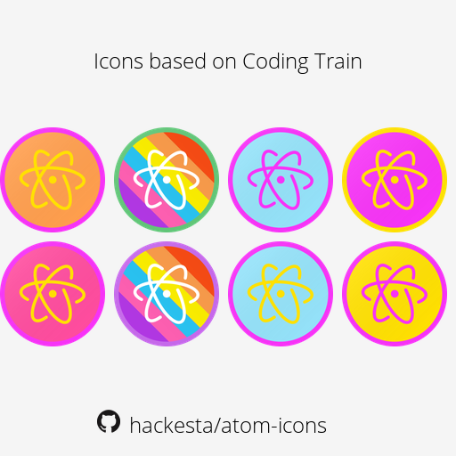

# icons-promo-maker
A python script to generate promo images for your icon projects

Sample Image from [atom-icons](https://github.com/hackesta/atom-icons)  

## Usage  
Put your icons in `icons` folder and run `main.py`

##### Configurations  
The following configurations are available:

| Variable | Values | Description |
|----------|--------|-------------|
| ICONS_FOLDER | filepath | Directory containing icons *Keep `/` at end* |
| ASSETS_FOLDER | filepath | Directory containing assets *Keep `/` at end* |
| SUPPORTED_TYPES | array of filetypes | Supported filetypes for icons |
| GITHUB_URL | URL | Github URL of your Icon Project Repo |
| IMAGE_CONFIG['name'] | string | Filename of generated image |
| IMAGE_CONFIG['mode'] | [MODE](https://pillow.readthedocs.io/en/3.0.x/handbook/concepts.html#concept-modes) | Image Mode to be used |
| IMAGE_CONFIG['title'] | string | Title of Image |
| IMAGE_CONFIG['github_mark'] | dark/light | Github Mark to use *Opposite to shade of background* |
| IMAGE_CONFIG['dimensions'] | int tuple | Dimension of generated image |
| IMAGE_CONFIG['background'] | HEX | Background Color to use |
| IMAGE_CONFIG['text_color'] | HEX | Text Color to use |
| IMAGE_CONFIG['text_font'] | filename | Font File to use *Should be present in `ASSETS_FOLDER`* |
| IMAGE_CONFIG['text_size'] | int | Font Size to use *best: 5% of image height* |
| IMAGE_CONFIG['spacing'] | int | Spacing between various elements |  

